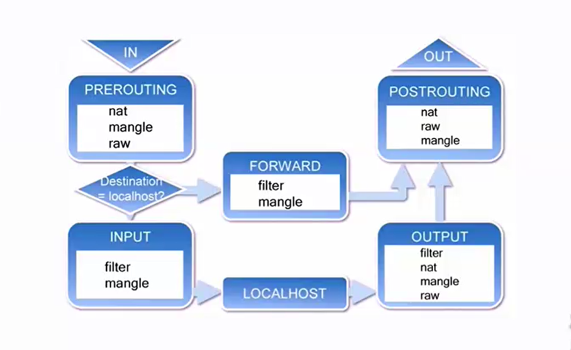

# iptables 笔记
## 结构

## iptables命令
显示列表：`iptables -t filter -L -n`      -t参数指定显示哪个链，默认filter链，加-v显示更详细信息，可看到哪张网卡流入流出 

清空设置：`iptables -F` 

阻止特定源ip（111.111.11.11）对目的ip（10.18.139.82）的8080端口访问：`iptables -I DOCKER -s 111.111.11.11 -d 10.18.139.82 -p TCP --dport 8080 -j DROP`  

添加一条开放端口的规则： `iptables -A INPUT -p tcp --dport 22 -j ACCEPT`  -A表示添加规则 

替换一条规则为开放220端口：`iptables -R INPUT 1 -p tcp --dport 220 -j ACCEPT` -R表示替换规则，`INPUT 1`表示INPUT链路的第1条规则，规则行号用`iptables -L -n --line-number`命令查看 

插入一条规则：`iptables -I INPUT 3 -p tcp --dport 220 -j ACCEPT`  -I表示插入规则

添加一条禁止端口的规则： `iptables -A INPUT -p tcp --dport 8080 -j DROP` 

删除一条规则：先使用 `iptables -L -n --line-number` 查看number，之后使用`iptables -D INPUT 3` 删除number号对应的规则 

通常设置只通过部分端口的规则需要设置允许换回链路，以及允许主动访问外网时外网的响应流量流入：`iptables -A INPUT -i lo -j ACCEPT`、`iptables -A INPUT -m state --state RELATED,ESTABLISHED -j ACCEPT`，第一条为环回链路，第二条为以连接或程序启动的向外端口允许流入

设置环回链路规则时，通过`iptable -L -n`命令看到不到详细信息会误以为通过了全部端口，使用`iptables -L -n -v`命令看详细信息，才可看到实际规则

一个规则里设置多个端口：`iptables -A INPUT -p tcp -m multiport --destination-ports 22,3306,443,80 -j ACCEPT`

命令里设置iptables规则，重启后将失效，通过`iptables-save > /root/iptables.conf`保存配置到文件里，重启后使用`iptables-restore < /root/iptables.conf`恢复配置。如果service iptables可以使用，则可以直接用`service iptables save`保存 

## ip黑名单

结合使用ipset软件设置ip黑名单

安装软件：`apt-get install ipset`

创建名单：`ipset create blacklist hash:net`    最后的参数还可以是：`hash:ip`、`hash:ip,port`等，名单是以hash方式存储的，所以不会怎么影响性能，hash size默认能存储1024个

创建自动过期的名单：`ipset create timoutlist hash:ip timeout 300`    300秒后自动过期

添加ip：`ipset add blacklist 1.1.1.1`

添加ip地址段：`ipset add blacklist 1.1.1.0/24` 前24byte的地址匹配

如果集合是ip,port的形式：`ipset add blacklist 1.1.1.1,80` 添加1.1.1.1的ip的80端口

查看列表：`ipset list`

查看集合内内容：`ipset list blacklist`

清空所有集合：`ipset flush`

清空单个集合：`ipset flush blacklist`

从集合删除内容：`ipset del blacklist x.x.x.x`

销毁集合：`ipset destroy blacklist`

使用ipset名单：`iptables -A INPUT -m set --match-set blacklist src -p tcp -j DROP`

如果是设置不匹配名单添加`!`符合即可：`iptables -A INPUT -m set ! --match-set blacklist src -p tcp -j DROP`

保存与恢复：通过`ipset save > /root/ipset.conf`保存配置到文件里，重使用`ipset restore < /root/ipset.conf`恢复配置