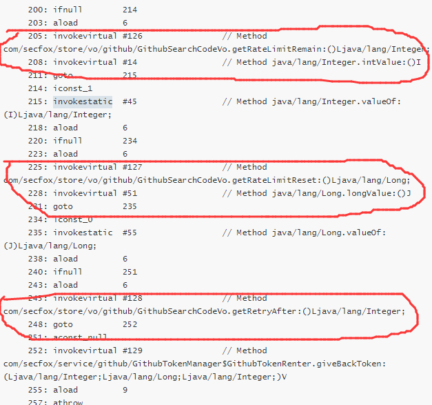

# JAVAP 反汇编字节码案例

javap 命令可将Java class文件反汇编为字节码，借助该命令可排查一些特殊的bug

## bug案例问题介绍

```
GithubTokenManager.GithubTokenRenter tokenRenter = null;
        GithubSearchCodeVo vo = null;
        try {
            tokenRenter = tokenManager.tryGetAvailableToken(GET_TOKEN_DELAY, GithubTokenManager.RentType.SEARCH_CODE);
            if (tokenRenter == null) {
                return null;
            }
            GithubToken token = tokenRenter.getToken();
            vo = searchCodeList(keywords, scopes, page, perPage, token.getToken());
            return vo;
        } finally {
            if (tokenRenter != null) {
                tokenRenter.giveBackToken(vo != null ? vo.getRateLimitRemain() : 1,       
                        vo != null ? vo.getRateLimitReset() : 0L, vo != null ? vo.getRetryAfter() : null);
            }
        }
```

上面代码运行，会出现偶现的NullPointerException，出现异常的代码位于`tokenRenter.giveBackToken(vo != null ? vo.getRateLimitRemain() : 1, vo != null ? vo.getRateLimitReset() : 0L, vo != null ? vo.getRetryAfter() : null)`，代码中涉及到的方法定义如下

```
void giveBackToken(Integer, Long, Integer);
Integer getRateLimitRemain();
Long getRateLimitReset();
Integer getRetryAfter();
```

## 问题排查步骤

使用javap命令对class文件进行反汇编，生成字节码

```
javap -c com.xxxx.xxxx.Githubxxxx
```

得到字节码信息，字节码中相关代码如下

```
0: aconst_null
       1: astore        5
       3: aconst_null
       4: astore        6
       6: aload         4
       8: ldc2_w        #122                // long 4000l
      11: getstatic     #124                // Field com/xxx/service/github/GithubTokenManager$RentType.SEARCH_CODE:Lcom/xxx/service/github/GithubTokenManager$RentType;
      14: invokevirtual #125                // Method com/xxx/service/github/GithubTokenManager.tryGetAvailableToken:(JLcom/xxx/service/github/GithubTokenManager$RentType;)Lcom/xxx/service/github/GithubTokenManager$GithubTokenRenter;
      17: astore        5
      19: aload         5
      21: ifnonnull     94
      24: aconst_null
      25: astore        7
      27: aload         5
      29: ifnull        91
      32: aload         5
      34: aload         6
      36: ifnull        50
      39: aload         6
      41: invokevirtual #126                // Method com/xxx/store/vo/github/GithubSearchCodeVo.getRateLimitRemain:()Ljava/lang/Integer;
      44: invokevirtual #14                 // Method java/lang/Integer.intValue:()I
      47: goto          51
      50: iconst_1
      51: invokestatic  #45                 // Method java/lang/Integer.valueOf:(I)Ljava/lang/Integer;
      54: aload         6
      56: ifnull        70
      59: aload         6
      61: invokevirtual #127                // Method com/xxx/store/vo/github/GithubSearchCodeVo.getRateLimitReset:()Ljava/lang/Long;
      64: invokevirtual #51                 // Method java/lang/Long.longValue:()J
      67: goto          71
      70: lconst_0
      71: invokestatic  #55                 // Method java/lang/Long.valueOf:(J)Ljava/lang/Long;
      74: aload         6
      76: ifnull        87
      79: aload         6
      81: invokevirtual #128                // Method com/xxx/store/vo/github/GithubSearchCodeVo.getRetryAfter:()Ljava/lang/Integer;
      84: goto          88
      87: aconst_null
      88: invokevirtual #129                // Method com/xxx/service/github/GithubTokenManager$GithubTokenRenter.giveBackToken:(Ljava/lang/Integer;Ljava/lang/Long;Ljava/lang/Integer;)V
      91: aload         7
      93: areturn
      94: aload         5
      96: invokevirtual #130                // Method com/xxx/service/github/GithubTokenManager$GithubTokenRenter.getToken:()Ljava/lang/Object;
      99: checkcast     #131                // class com/xxx/store/vo/github/GithubToken
     102: astore        7
     104: aload_0
     105: aload_1
     106: iload_2
     107: iload_3
     108: aload         7
     110: invokevirtual #132                // Method com/xxx/store/vo/github/GithubToken.getToken:()Ljava/lang/String;
     113: invokestatic  #133                // Method searchCodeList:(Ljava/lang/String;Ljava/lang/String;IILjava/lang/String;)Lcom/xxx/store/vo/github/GithubSearchCodeVo;
     116: astore        6
     118: aload         6
     120: astore        8
     122: aload         5
     124: ifnull        186
     127: aload         5
     129: aload         6
     131: ifnull        145
     134: aload         6
     136: invokevirtual #126                // Method com/xxx/store/vo/github/GithubSearchCodeVo.getRateLimitRemain:()Ljava/lang/Integer;
     139: invokevirtual #14                 // Method java/lang/Integer.intValue:()I
     142: goto          146
     145: iconst_1
     146: invokestatic  #45                 // Method java/lang/Integer.valueOf:(I)Ljava/lang/Integer;
     149: aload         6
     151: ifnull        165
     154: aload         6
     156: invokevirtual #127                // Method com/xxx/store/vo/github/GithubSearchCodeVo.getRateLimitReset:()Ljava/lang/Long;
     159: invokevirtual #51                 // Method java/lang/Long.longValue:()J
     162: goto          166
     165: lconst_0
     166: invokestatic  #55                 // Method java/lang/Long.valueOf:(J)Ljava/lang/Long;
     169: aload         6
     171: ifnull        182
     174: aload         6
     176: invokevirtual #128                // Method com/xxx/store/vo/github/GithubSearchCodeVo.getRetryAfter:()Ljava/lang/Integer;
     179: goto          183
     182: aconst_null
     183: invokevirtual #129                // Method com/xxx/service/github/GithubTokenManager$GithubTokenRenter.giveBackToken:(Ljava/lang/Integer;Ljava/lang/Long;Ljava/lang/Integer;)V
     186: aload         8
     188: areturn
     189: astore        9
     191: aload         5
     193: ifnull        255
     196: aload         5
     198: aload         6
     200: ifnull        214
     203: aload         6
     205: invokevirtual #126                // Method com/xxx/store/vo/github/GithubSearchCodeVo.getRateLimitRemain:()Ljava/lang/Integer;
     208: invokevirtual #14                 // Method java/lang/Integer.intValue:()I
     211: goto          215
     214: iconst_1
     215: invokestatic  #45                 // Method java/lang/Integer.valueOf:(I)Ljava/lang/Integer;
     218: aload         6
     220: ifnull        234
     223: aload         6
     225: invokevirtual #127                // Method com/xxx/store/vo/github/GithubSearchCodeVo.getRateLimitReset:()Ljava/lang/Long;
     228: invokevirtual #51                 // Method java/lang/Long.longValue:()J
     231: goto          235
     234: lconst_0
     235: invokestatic  #55                 // Method java/lang/Long.valueOf:(J)Ljava/lang/Long;
     238: aload         6
     240: ifnull        251
     243: aload         6
     245: invokevirtual #128                // Method com/xxx/store/vo/github/GithubSearchCodeVo.getRetryAfter:()Ljava/lang/Integer;
     248: goto          252
     251: aconst_null
     252: invokevirtual #129                // Method com/xxx/service/github/GithubTokenManager$GithubTokenRenter.giveBackToken:(Ljava/lang/Integer;Ljava/lang/Long;Ljava/lang/Integer;)V
     255: aload         9
     257: athrow
```

注意字节码中的这几行代码




发现`vo != null ? vo.getRateLimitRemain() : 1` 这个代码，会把`vo.getRateLimitRemain()`从Integer转成基础数据类型int，再转为Integer传给`giveBackToken`方法，而`vo != null ? vo.getRetryAfter() : null`这个代码，则不会转化为基础数据类型直接传给`giveBackToken`方法。说明了exp ? value1 : value2运算，value1和value2分别为基础数据类型和基础数据类型的包装类时，会统一转为基础数据类型。


## 测试验证

测试代码1：

```
public static void main(String[] args) {
    Tt tt = new Tt();
    tt.m = 6;
    test(tt != null ? tt.m : 2, tt != null ? tt.n : 6);
}

public static class Tt {
    Integer m;
    Integer n;
}
public static void test(Integer a, Integer b) {
    System.out.println(a + "--" + b);
}
```

运行结果为空指针异常


测试代码2

```
public static void main(String[] args) {
    Tt tt = new Tt();
    tt.m = 6;
    test(tt != null ? tt.m : Integer.valueOf(2), tt != null ? tt.n : Integer.valueOf(6));
}

public static class Tt {
    Integer m;
    Integer n;
}
public static void test(Integer a, Integer b) {
    System.out.println(a + "--" + b);
}
```

正常输出结果：6--null

